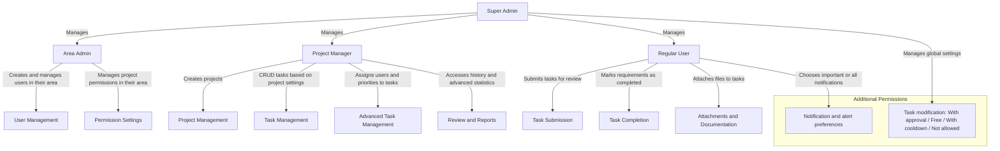

# Access Control Diagram

```mermaid
graph TD;
    A[Super Admin] -->|Manages| B[Area Admin];
    A -->|Manages| C[Project Manager];
    A -->|Manages| D[Regular User];

    B -->|Creates and manages users in their area| E[User Management];
    B -->|Manages project permissions in their area| F[Permission Settings];

    C -->|Creates projects| G[Project Management];
    C -->|CRUD tasks based on project settings| H[Task Management];
    C -->|Assigns users and priorities to tasks| I[Advanced Task Management];
    C -->|Accesses history and advanced statistics| J[Review and Reports];

    D -->|Submits tasks for review| K[Task Submission];
    D -->|Marks requirements as completed| L[Task Completion];
    D -->|Attaches files to tasks| M[Attachments and Documentation];

    subgraph Additional Permissions
        N[Task modification: With approval / Free / With cooldown / Not allowed]
        O[Notification and alert preferences]
    end

    A -->|Manages global settings| N;
    D -->|Chooses important or all notifications| O;
    
```

